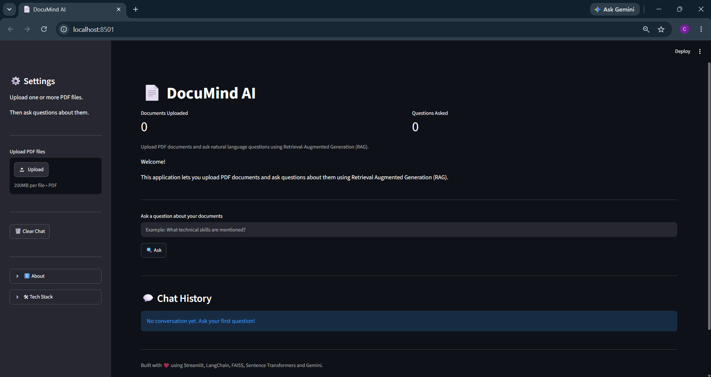
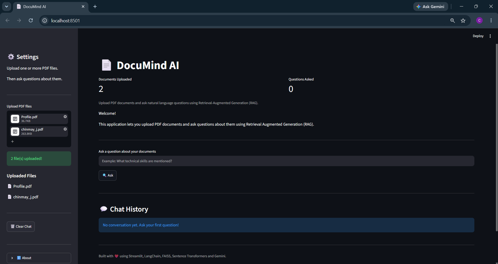
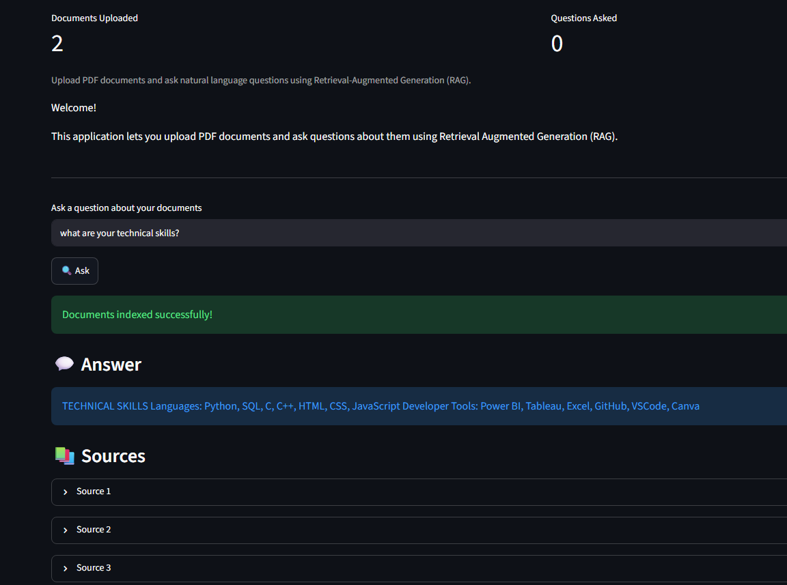
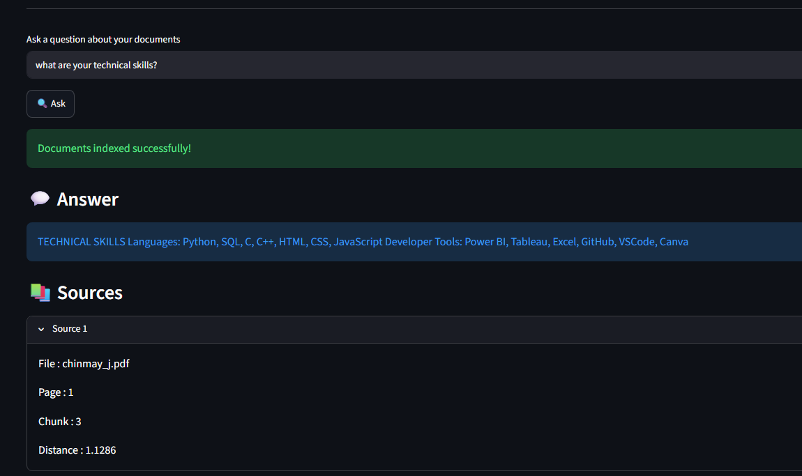
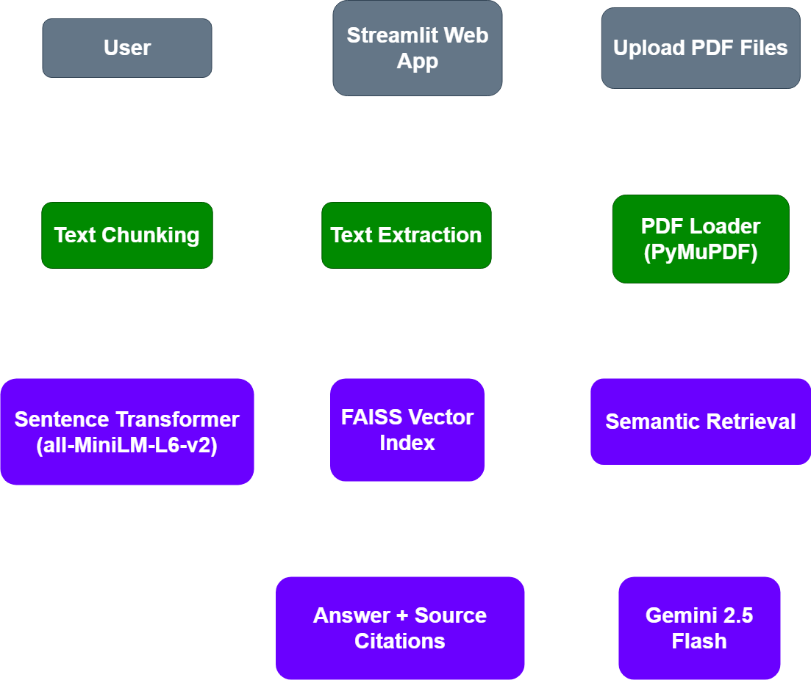

#  DocuMind AI

#  Intelligent Multi-PDF Question Answering using Retrieval-Augmented Generation (RAG)

DocuMind AI is an AI-powered document assistant that enables users to upload one or more PDF documents and ask natural language questions about their content.

The application combines semantic search using FAISS with Google's Gemini API to generate accurate, context-aware answers while citing the relevant document sources.

---

#  Features

-  Upload multiple PDF documents
-  Semantic search using FAISS
-  Gemini-powered answer generation
-  Source citations with page numbers
-  Chat-style interface
-  Fast vector retrieval
-  Sentence Transformer embeddings
-  Streamlit web application

---

#  Application Preview

### Home



---

### Upload Documents



---

### AI Response



---

### Source Citations



---

#  Tech Stack

| Category | Technologies |
|----------|--------------|
| Language | Python |
| Frontend | Streamlit |
| Embeddings | Sentence Transformers (all-MiniLM-L6-v2) |
| Vector Database | FAISS |
| LLM | Google Gemini 2.5 Flash |
| PDF Processing | PyMuPDF |
| Environment | python-dotenv |
| Logging | Python logging |

---

#  Architecture

<p align="center">
  
</p>

The application follows a Retrieval-Augmented Generation (RAG) pipeline:

1. Upload one or more PDF documents.
2. Extract text using PyMuPDF.
3. Split documents into semantic chunks.
4. Generate embeddings using Sentence Transformer (all-MiniLM-L6-v2).
5. Store embeddings in a FAISS vector index.
6. Retrieve the most relevant chunks for the user's question.
7. Generate a context-aware answer using Gemini 2.5 Flash.
8. Display the answer along with the document sources.

---

#  Project Architecture

```
            PDF Documents
                  │
                  ▼
          PDF Loader (PyMuPDF)
                  │
                  ▼
           Text Chunking
                  │
                  ▼
     Sentence Transformer Embeddings
                  │
                  ▼
            FAISS Vector Store
                  │
                  ▼
         Semantic Similarity Search
                  │
                  ▼
              Gemini API
                  │
                  ▼
         Context-Aware Response
                  │
                  ▼
          Streamlit Web Interface
```

#  Installation

Follow these steps below to setup and run DocuMind AI locally on your machine.

### 1. Clone the repository

```bash
git clone https://github.com/YOUR_USERNAME/documind-ai.git
```

### 2. Navigate to the project folder

```bash
cd documind-ai
```

### 3. Create a virtual environment

```bash
python -m venv .venv
```

### 4. Activate the virtual environment

**Windows**

```bash
.venv\Scripts\activate
```

**Linux / macOS**

```bash
source .venv/bin/activate
```

### 5. Install the required dependencies

```bash
pip install -r requirements.txt
```


#  Project Structure

DocuMind-AI/
│
├── assets/
│ ├── screenshots/
│ └── architecture.png
│
├── cache/
│
├── data/
│
├── src/
│ ├── embeddings.py
│ ├── llm.py
│ ├── pdf_loader.py
│ ├── prompt_builder.py
│ ├── rag_pipeline.py
│ ├── retriever.py
│ ├── source_formatter.py
│ ├── text_splitter.py
│ ├── vector_store.py
│ └── ...
│
├── streamlit_app.py
├── requirements.txt
└── README.md

---

#  Installation

